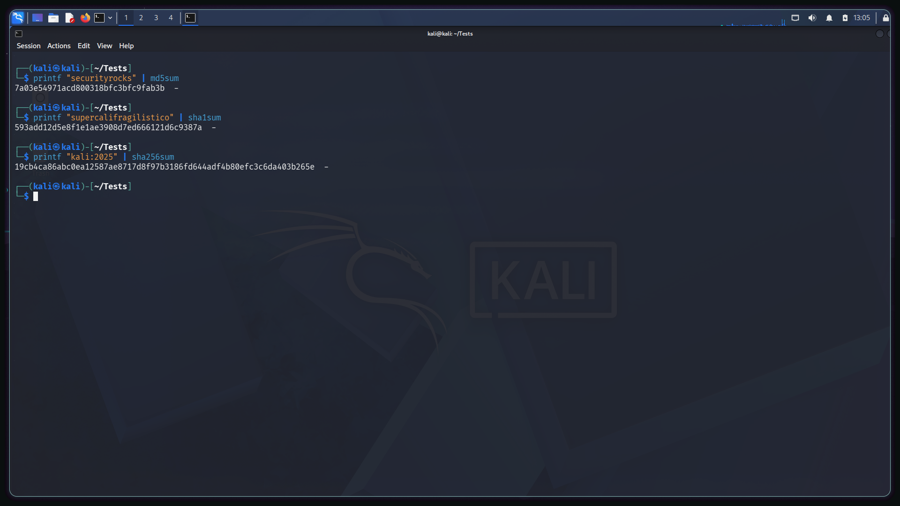
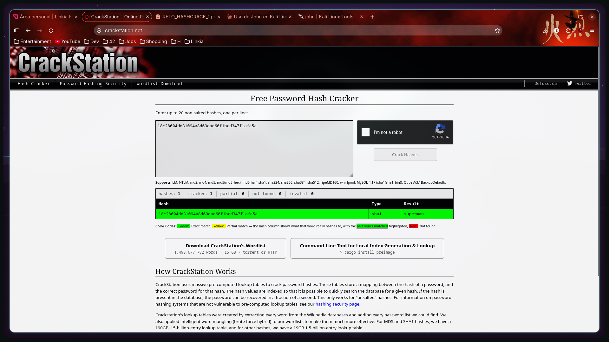
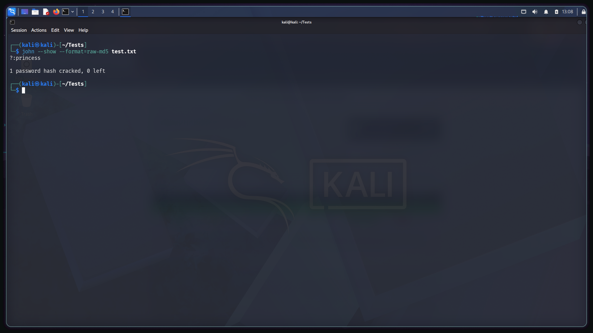

# Hola

- Generación: CTF{7a03e54971acd800318bfc3bfc9fab3b}
- Crackeo: CTF{securityrocks}

- Generación: CTF{593add12d5e8f1e1ae3908d7ed666121d6c9387a}
- Crackeo: CTF{supercalifragilistico}

- Generación: CTF{19cb4ca86abc0ea12587ae8717d8f97b3186fd644adf4b80efc3c6da403b265e}
- Crackeo: CTF{kali:2025}

La teoría es simple, se recoge el string a hashear y mediante un algoritmo matemático
se tranforma en una cadena de caracateres única.
<\br>

- Generación: CTF{18c28604dd31094a8d69dae60f1bcd347f1afc5a}
- Crackeo: CTF{superman}

La teoría es simple, es una página web que tiene detrás en sus servidores una tabla
masiva de hashes pre-computados, busca el hash entre todos los que tiene y devuelve
el resultado en caso de que se encuentre en esta base de datos.
<\br>

- Generación: CTF{8afa847f50a716e64932d995c8e7435a}
- Crackeo: CTF{princess}

Lo mismo que el crack station, pero más limitado, usando un wordlist (un fichero
txt que contiene los hashes precomputados) como datos pre-computados.
